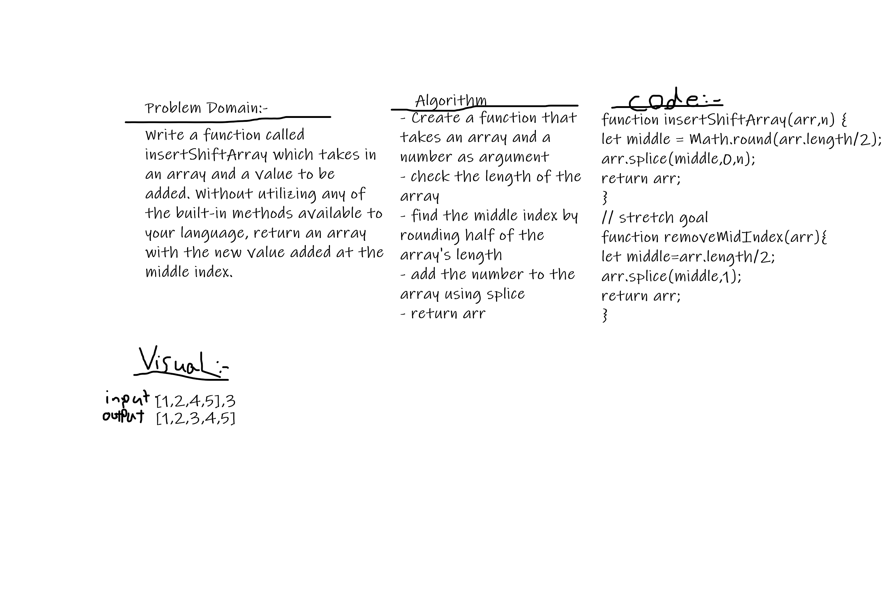

# Insert to Middle of an Array
- Write a function called insertShiftArray which takes in an array and a value to be added. Without utilizing any of the built-in methods available to your language, return an array with the new value added at the middle index.

- Stretch goal: Write a second function that removes an element from the middle index and shifts other elements in the array to fill the new gap.

## Whiteboard Process

## Approach & Efficiency
- I used splice to add the number to a specific index in the array, and Math.round to get the middle if we had an odd length
- for the stretch goal I use splice to remove 1 element starting from the middle of the array