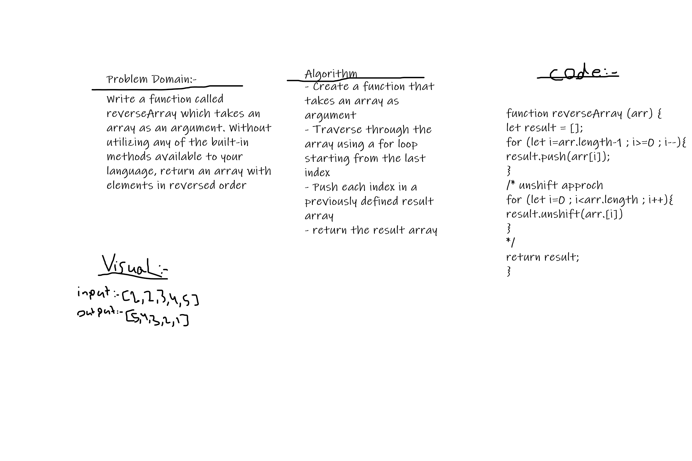

# Reverse an Array
Write a function called **reverseArray** which takes an array as an argument. Without utilizing any of the built-in methods available to your language, return an array with elements in reversed order
- Example:
    input: [1, 2, 3, 4, 5, 6] ---> output: [6, 5, 4, 3, 2, 1]
    input: [89, 2354, 3546, 23, 10, -923, 823, -12] --> output: [-12, 823, -923, 10, 23, 3546, 2354, 89]

## Whiteboard Process

## Approach & Efficiency
- array.push approach
will add the value to the last index of result.
- array.unshift approach
will add the value to the 1st index of result.

- I don't think there is a different in efficiency between both approaches.