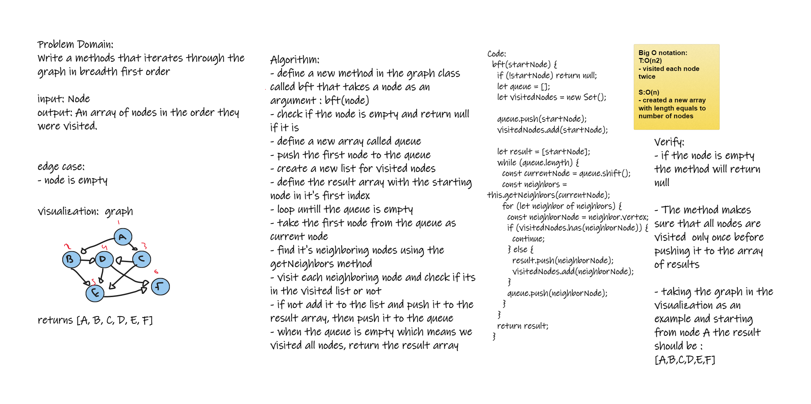
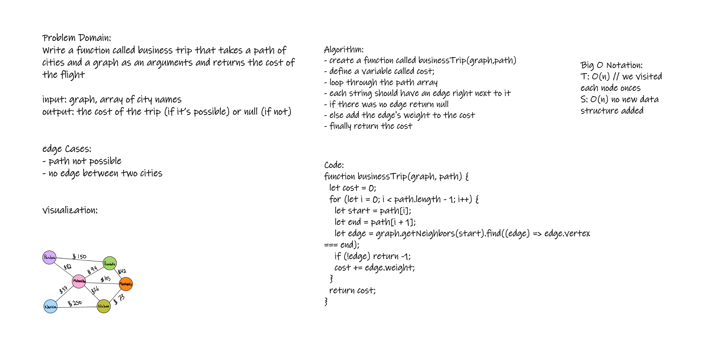

# Graphs

points, called vertices, and lines between those points, called edges. There are many different types of graphs, such as connected and disconnected graphs, bipartite graphs, weighted graphs, directed and undirected graphs, and simple graphs.

## Challenge

Implement your own Graph. The graph should be represented as an adjacency list, and should include the following methods:

- add node
  - Arguments : value
  - returns: the added node
- add edge
  - Arguments : node1, node2, weight
  - returns: nothing
- get nodes
  - Arguments : nothing
  - returns: an array of nodes
- get neighbors
  - Arguments : node
  - returns: an array of nodes
- size
  - Arguments : nothing
  - returns: the number of nodes in the graph
- breadthFirst
  - arguments: starting node
  - returns: and array of available nodes

## Approach & Efficiency

- add node:
  - T: O(1) - we are adding to an array, so it is constant time
  - S: O(1) - we are adding to an array, so it is constant space
- add edge:
  - T: O(1) - we are adding to an array, so it is constant time
  - S: O(1) - we are adding to an array, so it is constant space
- get nodes
  - T: O(n) - we are iterating through the array, so it is linear time
  - S: O(n) - we are creating an array, so it is linear space
- get neighbors
  - T: O(n) - we are iterating through the array, so it is linear time
  - S: O(n) - we are creating an array, so it is linear space
- size:
  - T: O(1) - we are reading from an array, so it is constant time
  - S: O(1) - we didnt create any new data structures, so it is constant space
- breadthFirst

  - T: O(n2) - we are visting each node twice in the worst case, so it is quadratic time
  - S: O(n) - we created a new array of length n to store the nodes, so it is linear space

- businessTrip
  - Time complexity: O(n) we visit each node once
  - space complexity: O(1) we didnt create any new data structures

## API

class : Graph

- add node: adds a node to the graph
- add edge: adds an edge to the graph
- getNodes: return an array of nodes
- getNeighbors: return an array of neighbors of a node
- size: return the number of nodes in the graph
- breadthFirst: return an array of nodes in breadth first order
- businessTrip : return the cost of a business trip

## Whiteboarding

- breadth first order:
  

- businessTrip:
  
