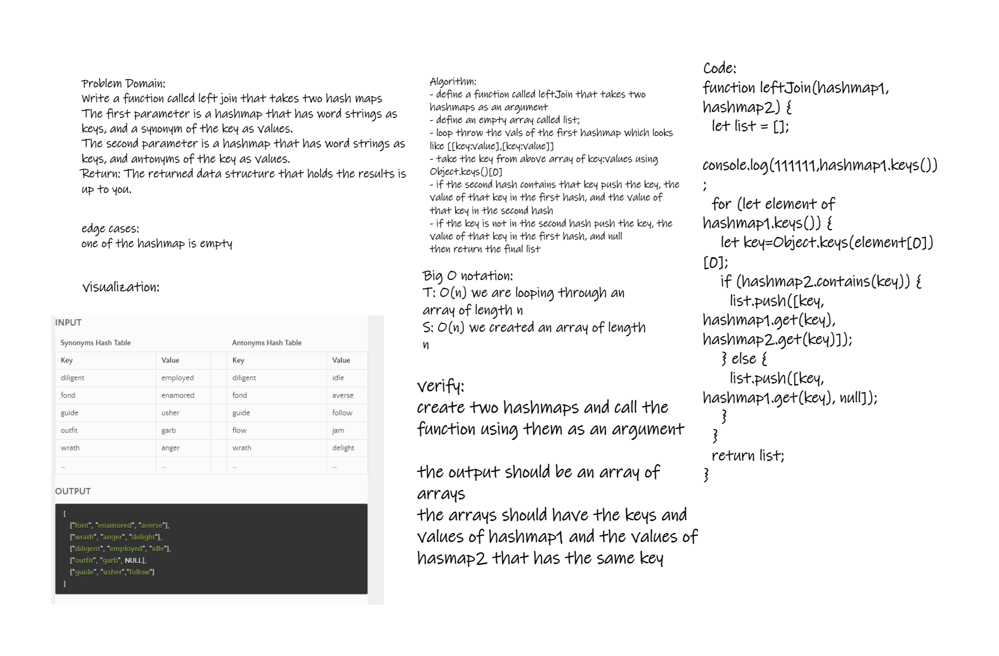

# Challenge Summary

- Write a function called left join that takes two hash maps
  - The first parameter is a hashmap that has word strings as keys, and a synonym of the key as values.
  - The second parameter is a hashmap that has word strings as keys, and antonyms of the key as values.
  - Return: The returned data structure that holds the results is up to you.

## WB

;

## Approach & Efficiency

- T:O(n) --> we are iterating throught an array
- S:O(n) --> we created an array of length n

## Solution

- call the function `left join` with two hashes as arguments
- an array of arrays of key,value1,value2 if the keys are in both hashes and key,value1,null if the key is only in the first hash
