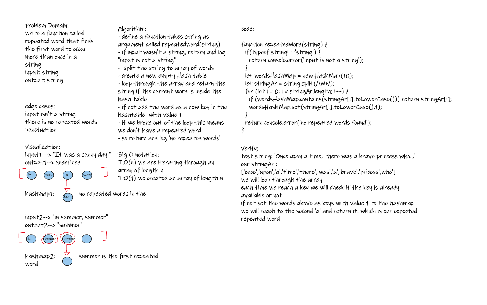

# Challenge Summary

Write a function called repeated word that finds the first word to occur more than once in a string

- Arguments: string
- Return: string

## Whiteboard Process

## Approach & Efficiency

- T:O(n) --> we are iterating throught an array
- S:O(n) --> we created an array of length n

## Solution

- call the function `repeatedWord` with a string as an argument
- function should return the first word to occur twice
- if there was no repeated word will return undefined & logs that there was no repeated words
- if input wasn't a string logs input isn't a string