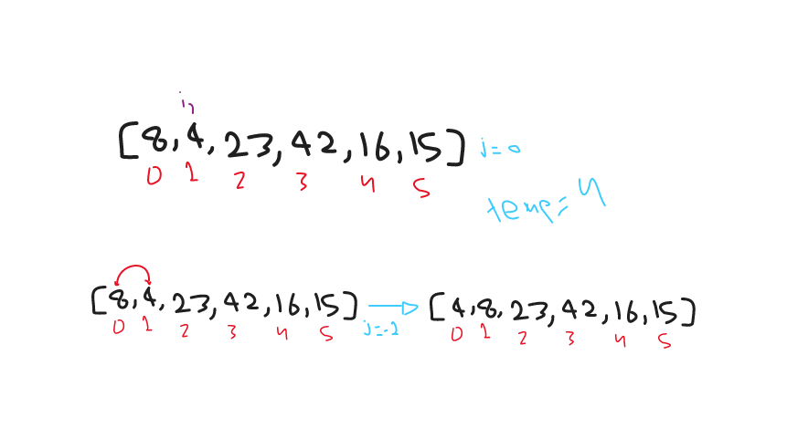
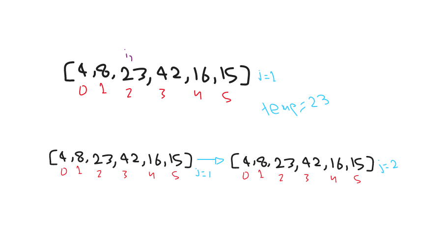
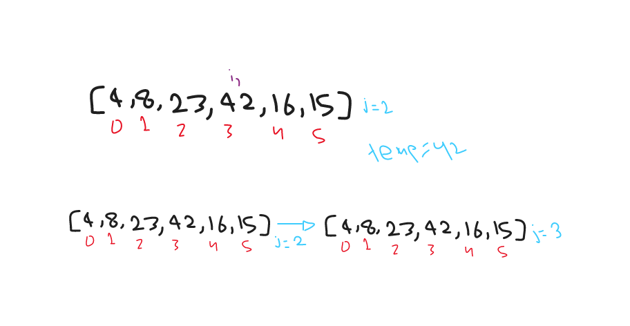
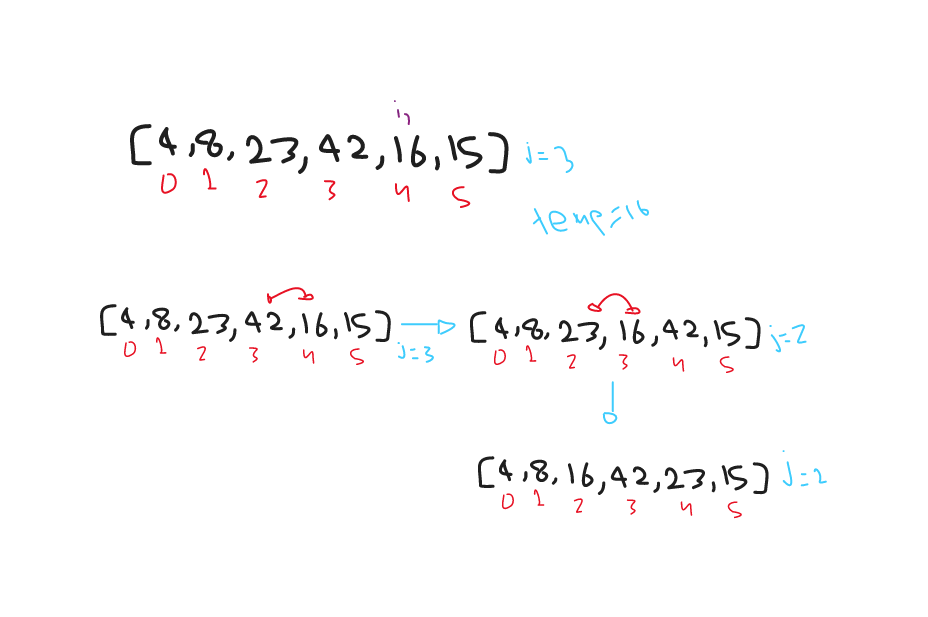
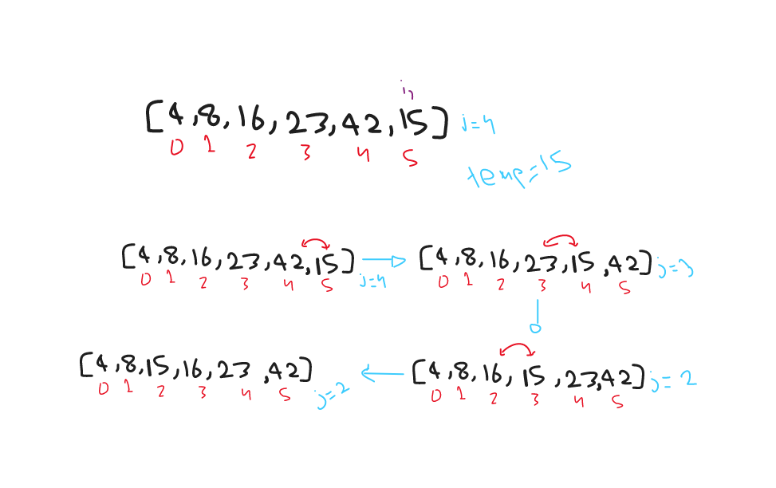

# Insertion Sort

Insertion sort is a simple sorting algorithm that works similar to the way you sort playing cards in your hands. The array is virtually split into a sorted and an unsorted part. Values from the unsorted part are picked and placed at the correct position in the sorted part.

## Pseudocode

```pseudo
  InsertionSort(int[] arr)

    FOR i = 1 to arr.length

      int j <-- i - 1
      int temp <-- arr[i]

      WHILE j >= 0 AND temp < arr[j]
        arr[j + 1] <-- arr[j]
        j <-- j - 1

      arr[j + 1] <-- temp
```

## trace

sample array: `[8,4,23,42,16,15]`

- **pass1**

  

  in the first pass, we started with the second index of the array and check if there was any number higher than it from the index before it and if there was a number higher that it, we will move it one step behind that number.

- **pass2**

  

  in the second pass, index = 2 is already higher than the index before it, so there was no changes in the array.

- **pass3**

  

  in the third pass, index = 3 is already higher than the index before it, so there was no changes in the array.

- **pass4**

  

  in the fourth pass, index = 4 is lower than the prev index, so we will switch them, and check the index behind that as well which is smaller than the one we started with move it backwards one more time.

- **pass5**

  

  in the fifth and final iteration, we have check index 5 with all of the previous indices before it, and moved it back each time the prev indix value was higher than it.

## Efficency

- Time: O(n^2)
  - we do multiple comparisons on each iteration
- Space: O(1)
  - No additional space is being created.
