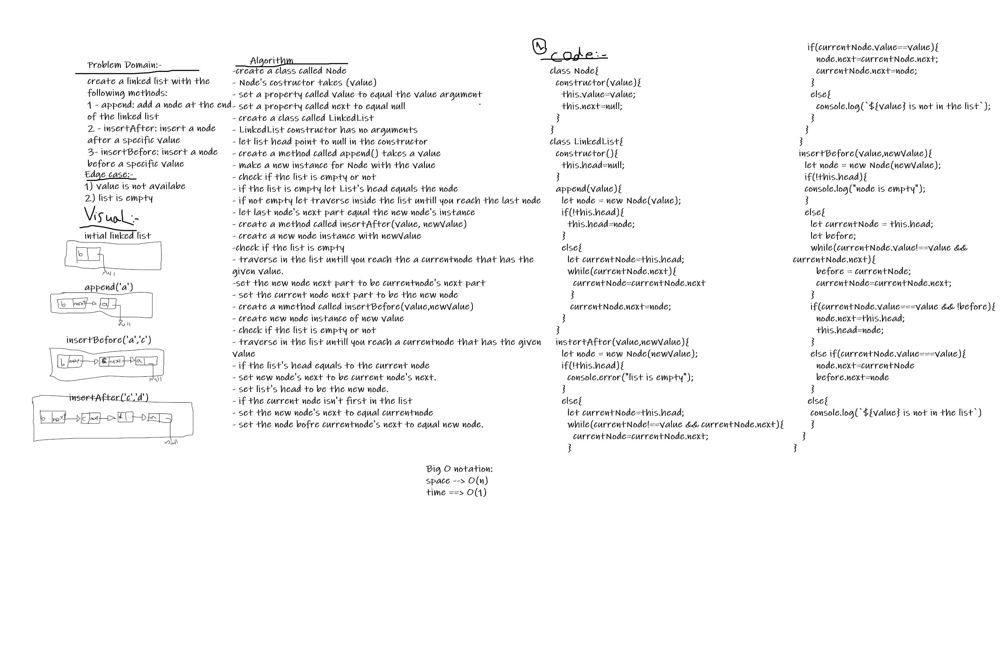

# Challenge Summary
Create a linkedList class that has 3 methods:
1. append: insert a new node to the end of linked list.
2. insertAfter: add a node after a specific value.
3. insertBefroe: add a node before a specific value
## Whiteboard Process

## Approach & Efficiency
Big O -> time complexity O(1), Big O -> space complexity O(n)
## Solution
- create a new instance with LinkedList class add to it a value `let list = new LinkedList(value)`
- to add a new node with value use `list.append(value)` 
- to add a node before a value use `insertBefore(value,newValue)`
- to add a node after a value use `instertAfter(value,newValue)`