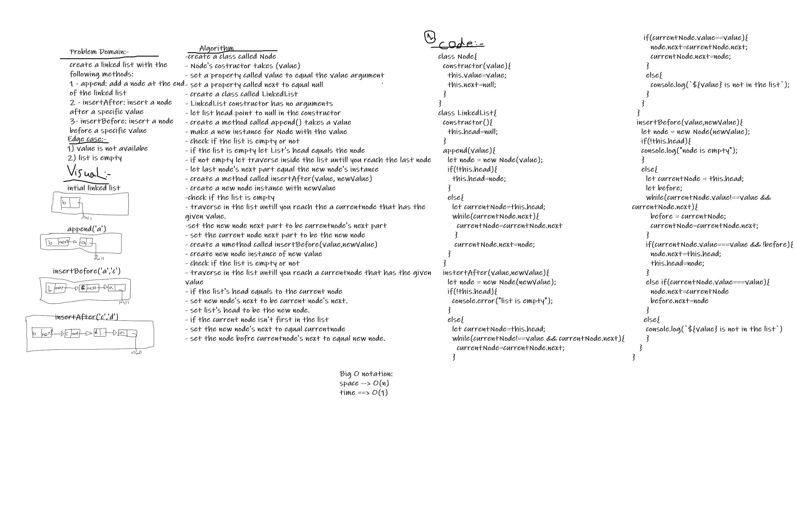
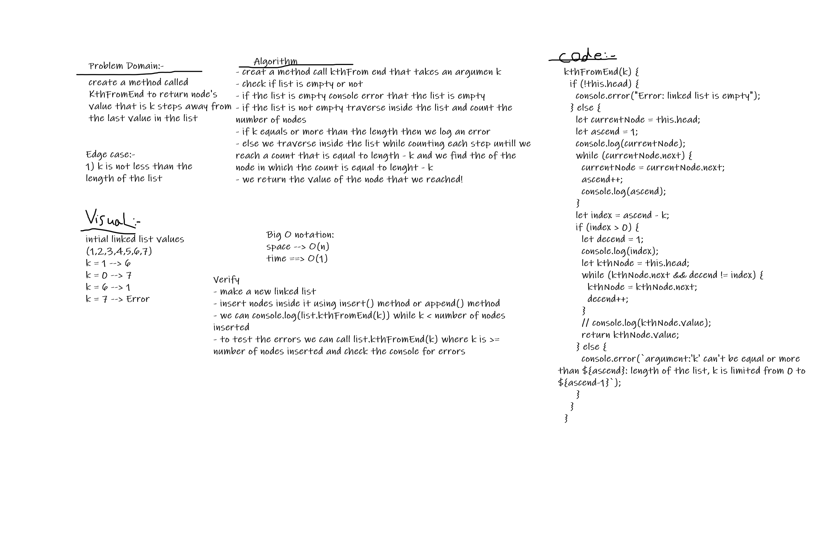

## Challenge Summary
- Linked-list: Create a linkedList class that has 3 methods:
    1. insert: insert a new node to the linked list.
    2. includes: check if the linked list includes a value and return true if it's include and false if not.
    3. toString: retun a string that shows the components of the linked list as  
- linked-list-insertions: insert with 3 methods:
    1. append: insert a new node to the end of linked list.
    2. insertAfter: add a node after a specific value.
    3. insertBefroe: add a node before a specific value 
- linked-list-kth: return the value that counting k from the end of the list

## Whiteboard Process
- linked-list-insertions:

- linked-list-kth:

## Approach & Efficiency
Big O -> time complexity O(1), Big O -> space complexity O(n)
## API
1. insert: insert a new node to the linked list.
2. includes: check if the linked list includes a value and return true if it's include and false if not.
3. toString: retun a string that shows the components of the linked list as string
4. append: insert a new node to the end of linked list.
5. insertAfter: add a node after a specific value.
6. insertBefroe: add a node before a specific value
7. kthFromEnd: return the value that is k steps away from the end of list
## solution
- create a new instance with LinkedList class add to it a value `let list = new LinkedList(value)`
- to add a new node to the start of the list with value use `list.insert(value)`
- to check if the list includes a value `list.includes(value)`
- to strigify the list and return it like "{a}->{b}->{c}->null" `list.toString()`
- to add a new node to the end of the list with value use `list.append(value)`
- to add a node before a value use `insertBefore(value,newValue)`
- to add a node after a value use `instertAfter(value,newValue)` 
- to return the kth value from the end of the list use `list.kthFromEnd(k)`