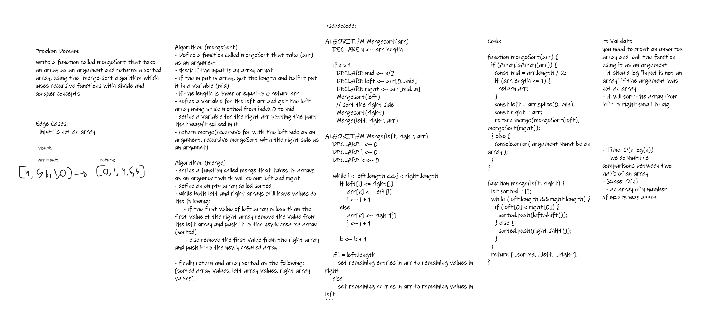

# Challenge Summary

The merge sort is one of the more advanced sorting algorithms that’s quite efficient in sorting large amounts of data. The algorithm uses the recursive function concept with divide and conquer strategy to efficiently sort a given list of elements.

refer to [blog](./BLOG.md) for more info.

## Whiteboard Process



## Solution

to run the function just call it with an unsorted array,

- mergeSort([4,5,8,9,75,1,0,18]) the returned value should be [0,1,4,5,8,9,18,75];

```javascript
console.log(mergeSort([4, 5, 8, 9, 75, 1, 0, 18]));
// output: [0,1,4,5,8,9,18,75]
```
