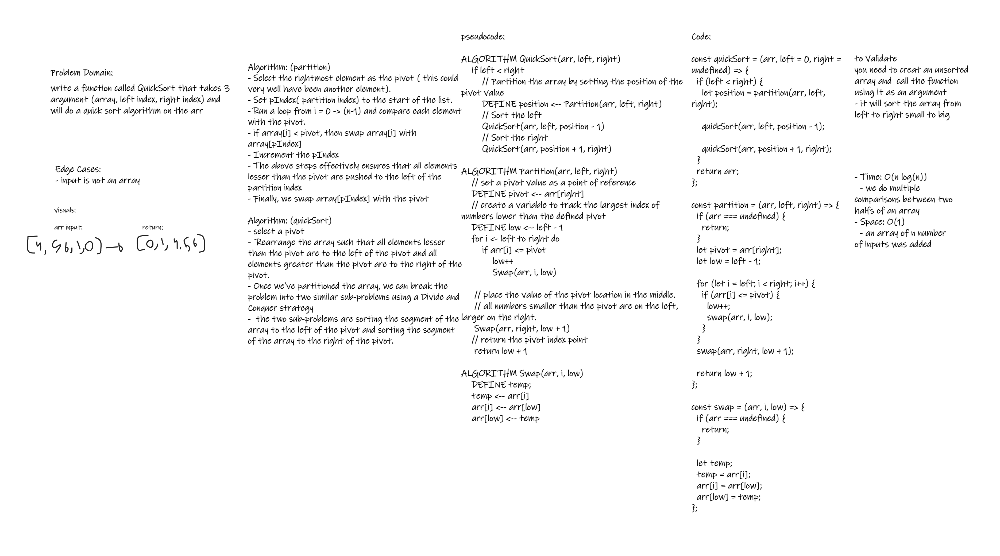

# Challenge Summary

Given this psuedocode:

ALGORITHM QuickSort(arr, left, right)
    if left < right
        // Partition the array by setting the position of the pivot value 
        DEFINE position <-- Partition(arr, left, right)
        // Sort the left
        QuickSort(arr, left, position - 1)
        // Sort the right
        QuickSort(arr, position + 1, right)

ALGORITHM Partition(arr, left, right)
    // set a pivot value as a point of reference
    DEFINE pivot <-- arr[right]
    // create a variable to track the largest index of numbers lower than the defined pivot
    DEFINE low <-- left - 1
    for i <- left to right do
        if arr[i] <= pivot
            low++
            Swap(arr, i, low)

     // place the value of the pivot location in the middle.
     // all numbers smaller than the pivot are on the left, larger on the right. 
     Swap(arr, right, low + 1)
    // return the pivot index point
     return low + 1

ALGORITHM Swap(arr, i, low)
    DEFINE temp;
    temp <-- arr[i]
    arr[i] <-- arr[low]
    arr[low] <-- temp
review the pusedocode

trace the algorithm
==> stepping through the process with the sample array:
[8,4,23,42,16,15]

create a blog article that documents your explaination
==> showing a step-by-step output after each iteration through some sort of visual

after creating the article
==> write a working, tested code implementation of Insertion Sort based on the pseudocode

other sample input (for understanding & testing):

Reverse-sorted: [20,18,12,8,5,-2]
Few uniques: [5,12,7,5,5,7]
Nearly-sorted: [2,3,5,7,13,11]

## Whiteboard process



## Solutions

to run the function just call it with an unsorted array,

- quickSort([4,5,8,9,75,1,0,18],0,8) the returned value should be [0,1,4,5,8,9,18,75];

```javascript
console.log(quickSort([4, 5, 8, 9, 75, 1, 0, 18],0,8));
// output: [0,1,4,5,8,9,18,75]
```
