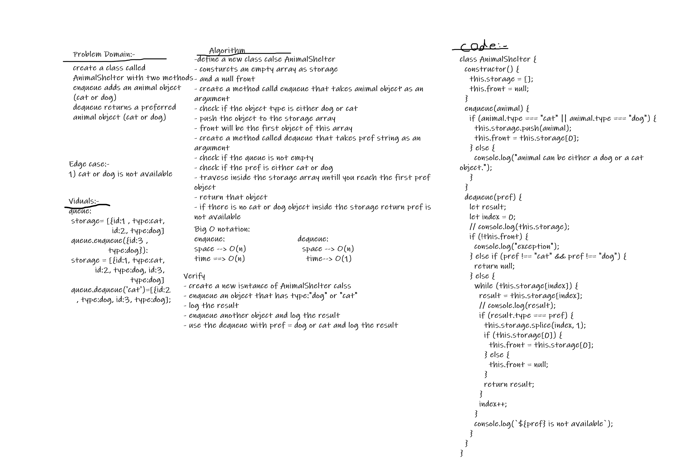

# Animal Shelter Queues

## Challenge Summary

- Create a class called AnimalShelter which holds only dogs and cats.
- The shelter operates using a first-in, first-out approach.
- Implement the following methods:
- enqueue
  - Arguments: animal
    - animal can be either a dog or a cat object.
- dequeue
  - Arguments: pref
    - pref can be either "dog" or "cat"
  - Return: either a dog or a cat, based on preference.
    - If pref is not "dog" or "cat" then return null.

## Whiteboard Process

## Approach & Efficiency

enqueue:
Big O -> time complexity O(n), Big O -> space complexity O(n)
dequeue:
Big O -> time complexity O(1), Big O -> space complexity O(n)

## solution

Class AnimalShelter: creates a new instance of AnimalShelter that has storage as an array and null front;
enqueue: inserts an animal object into the AnimalShelter instance using FIFO.
dequeu: extracts a preferred object from the AnimalShelter instance using FIFO.
