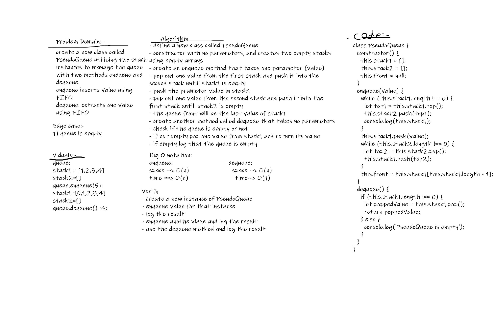

# Pseudo-Queue

## Challenge Summary

- Create a new class called pseudo queue.
  - Internally, utilize 2 Stack instances to create and manage the queue
- Methods:
  - enqueue
    - Arguments: value
    - Inserts value into the PseudoQueue, using a first-in, first-out approach.
  - dequeue
    - Arguments: none
    - Extracts a value from the PseudoQueue, using a first-in, first-out approach.

## Whiteboard Process

## Approach & Efficiency

enqueue:
Big O -> time complexity O(n), Big O -> space complexity O(n)
dequeue:
Big O -> time complexity O(1), Big O -> space complexity O(n)

## solution

Class PseudoQueue: creates a new instance of PseudoQueue that has two empty stacks;
enqueue: inserts a value into the PseudoQueue instance using FIFO.
dequeu: extracts a value from the PseudoQueue instance using FIFO.
