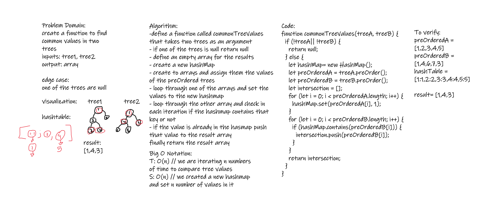

# Challenge Summary

create a function to find common values in two trees
inputs: tree1, tree2
output: array

## Whiteboard Process

## Approach & Efficiency

- T:O(n) --> we are iterating throught an array
- S:O(n) --> we created an array of length n

## Solution

- call the function `commonTreeValues` with a two trees as an argument
- function should return an array of common values between trees
- if there was no common values the function will return an empty array
- if one of the inputs were null function will return null
